# Flutter Music App

First Open Source Flutter based dribbblel Design Music Player.

#### logo


#### free design

http://www.freeuid.com/category/free

#### material icons

https://material.io/resources/icons/?search=d&style=baseline

#### generate logo（android &ios）

http://icon.wuruihong.com/

## Features(Android & iOS)

  * [x] search online songs (Require Network Permission)
  * [x] Beautiful UI with multiple themes includes light theme and dark theme
  * [x] multiple language includes chinese and english
  * [x] Play background
  * [x] Animation
  * [x] Full Fledged Example
  * [x] Play / Stop / Pause
  * [x] Previous / Next
  * [x] Seek
  * [x] Shuffle
  * [x] Album Art
  * [x] onComplete
  * [x] onDuration / onCurrentPosition
  * [x] Favorite
  * [x] Download

### Show some ❤️ and star the repo to support the project


## Screenshots(iOS)

- #### Light theme

| 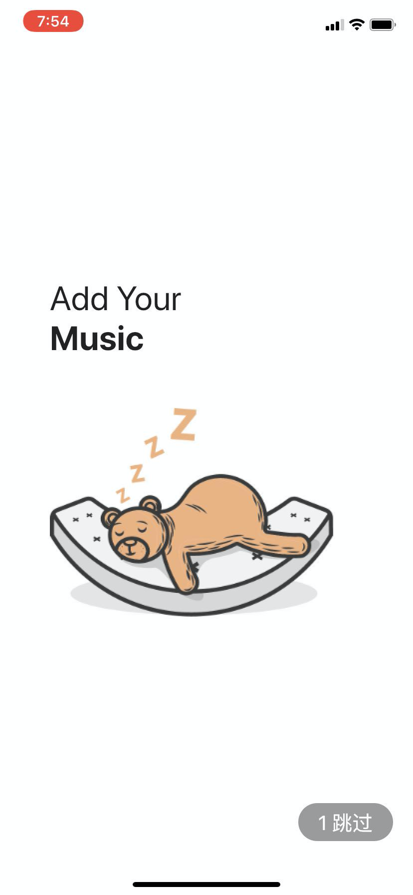 | 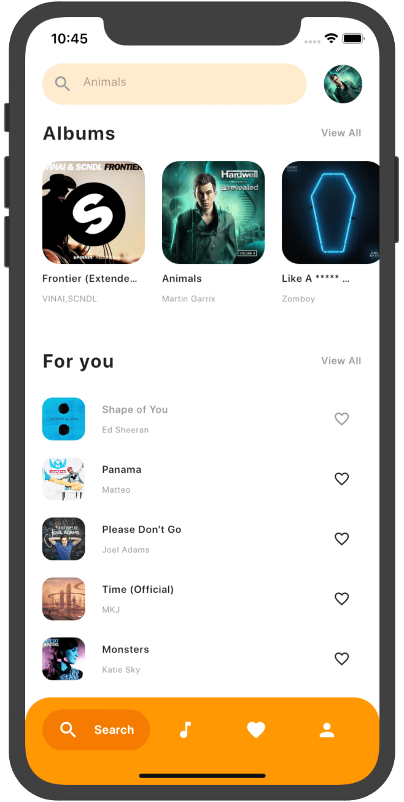 | 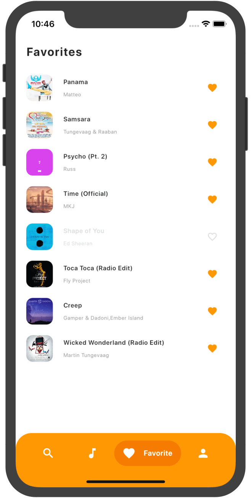 |
| -------------------------------------------- | ---------------------------------- | ---------------------------------- |
| 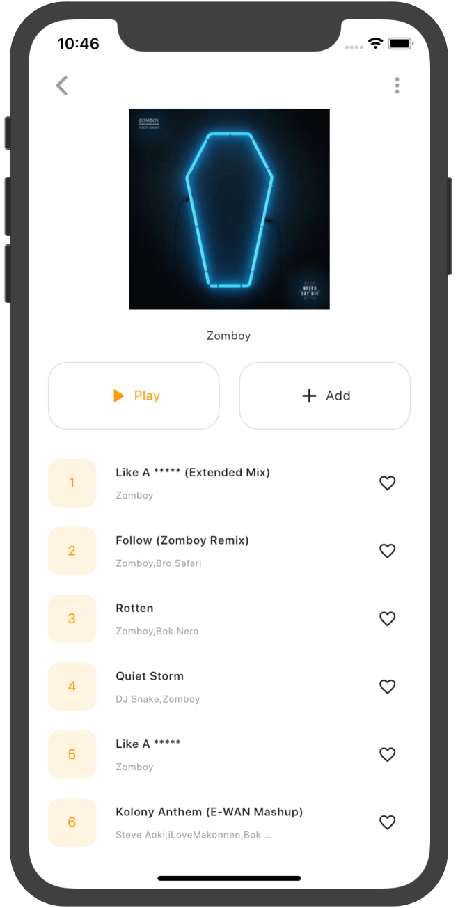           | 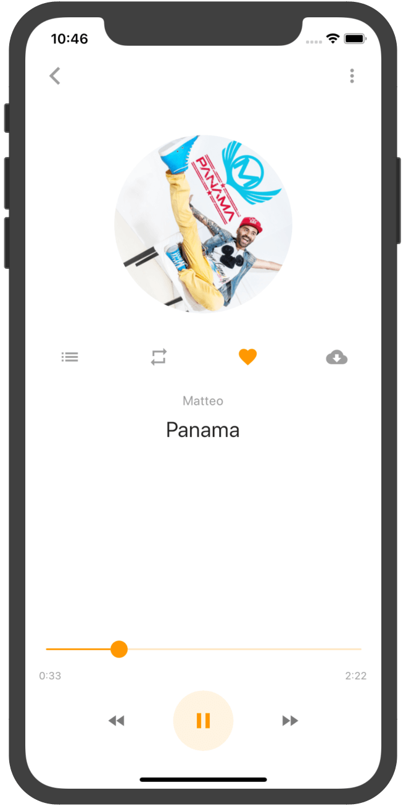 | 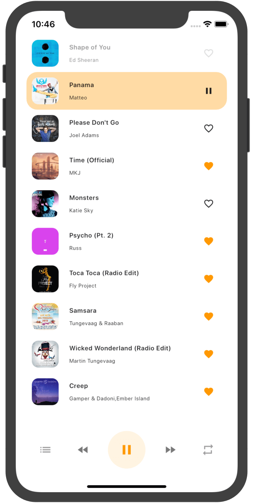 |

- #### Dark theme

| 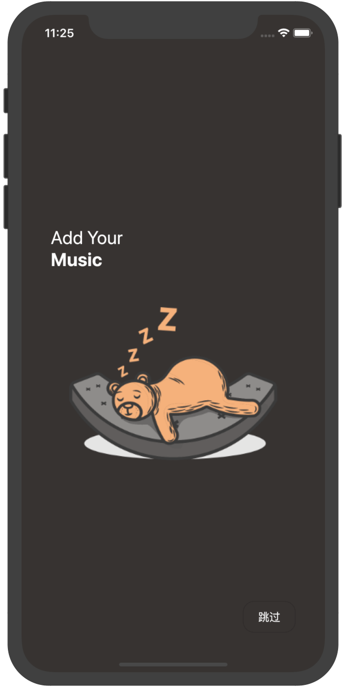 | 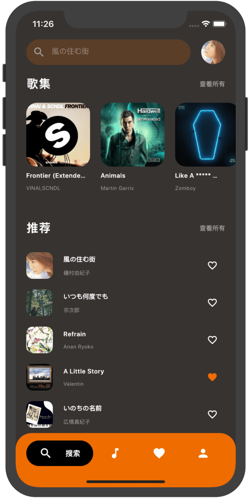 | 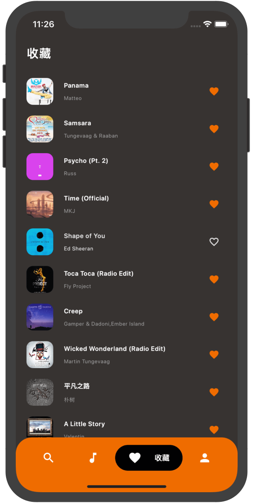 |
| ---------------------------------- | ---------------------------------- | ---------------------------------- |
| 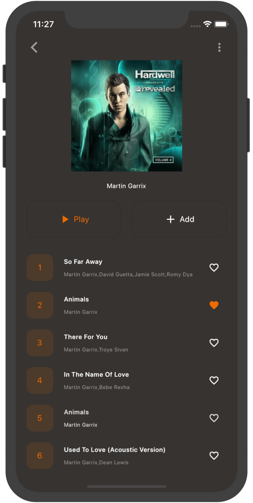 | 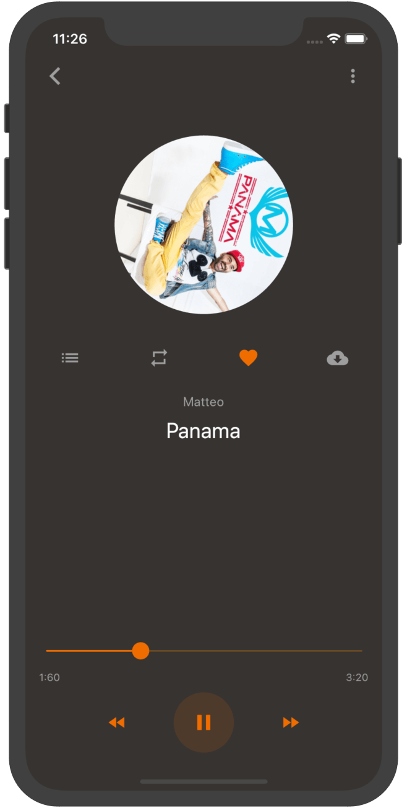 | 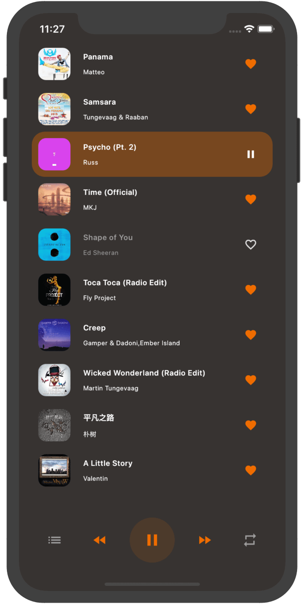 |

### Screenshots(Android)

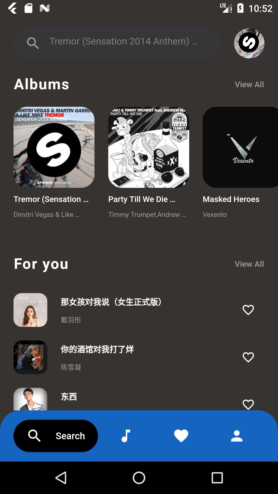 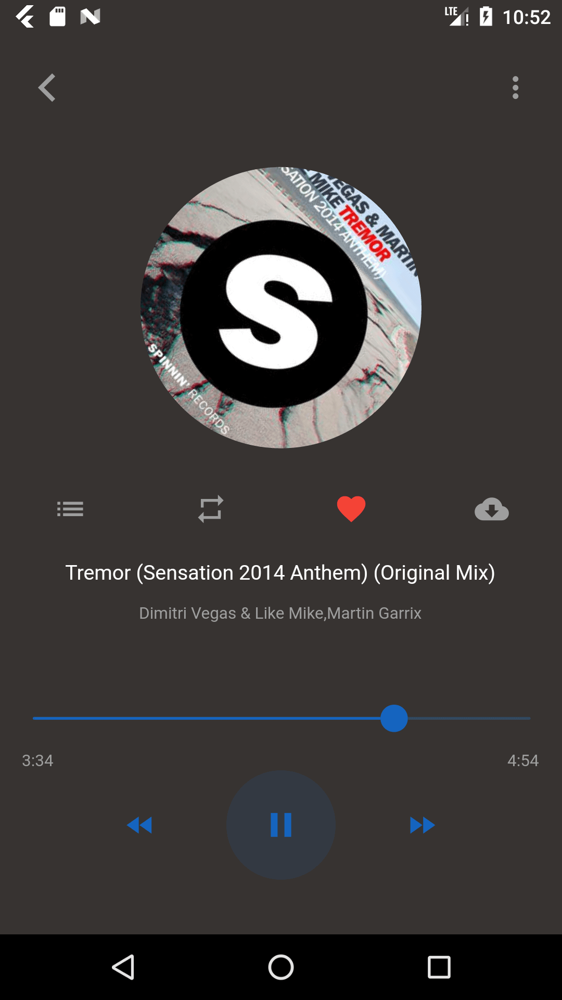 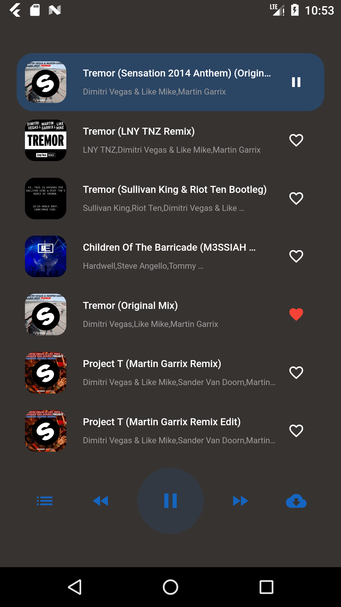 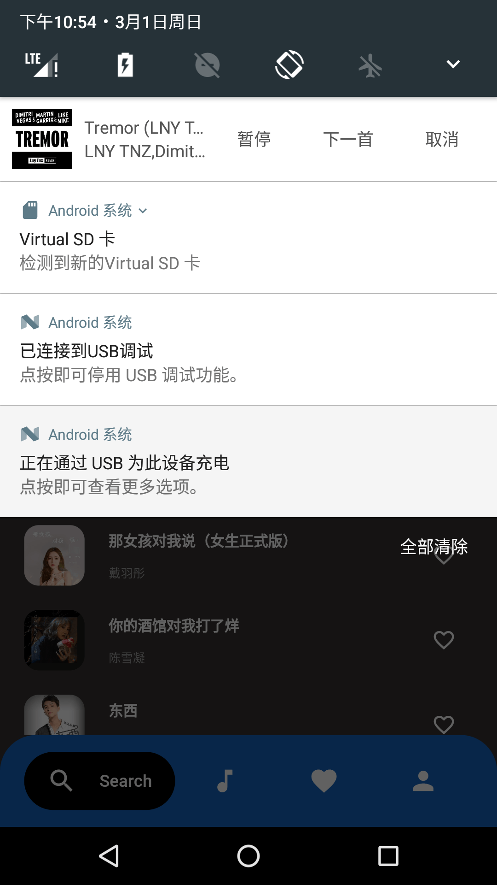 


### Add this to ios Info.plist allow https and background

```yaml
    <key>UIBackgroundModes</key>
    <array>
        <string>audio</string>
    </array>
    <key>NSAppTransportSecurity</key>
    <dict>
    <key>NSAllowsArbitraryLoads</key>
    <true/>
    </dict>
```

> If you found this project helpful or you learned something from the source code and want to thank me, consider buying me a cup of ☕️

 

# License

```
Copyright 2020 obnil

Licensed under the Apache License, Version 2.0 (the "License");
you may not use this file except in compliance with the License.
You may obtain a copy of the License at

   http://www.apache.org/licenses/LICENSE-2.0

Unless required by applicable law or agreed to in writing, software
distributed under the License is distributed on an "AS IS" BASIS,
WITHOUT WARRANTIES OR CONDITIONS OF ANY KIND, either express or implied.
See the License for the specific language governing permissions and
limitations under the License.
```

## Getting Started

This project is a starting point for a Flutter application.

A few resources to get you started if this is your first Flutter project:

- [Lab: Write your first Flutter app](https://flutter.dev/docs/get-started/codelab)
- [Cookbook: Useful Flutter samples](https://flutter.dev/docs/cookbook)

For help getting started with Flutter, view our
[online documentation](https://flutter.dev/docs), which offers tutorials,
samples, guidance on mobile development, and a full API reference.
